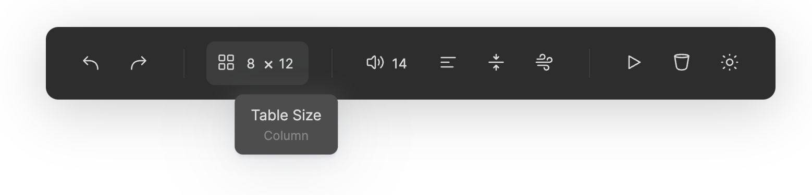
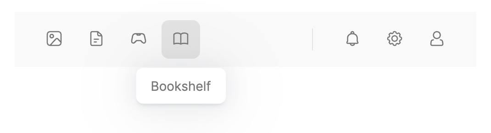
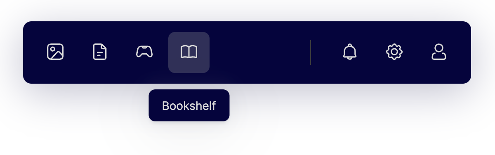
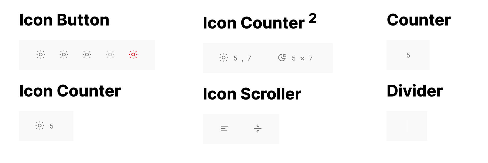

```
 ______                        ___    __
/\__  _\                      /\_ \  /\ \
\/_/\ \/   ___     ___     ___\//\ \ \ \ \____     __     _ __
   \ \ \  / __`\  / __`\  / __`\\ \ \ \ \ '__`\  /'__`\  /\`'__\
    \ \ \/\ \L\ \/\ \L\ \/\ \L\ \\_\ \_\ \ \L\ \/\ \L\.\_\ \ \/
     \ \_\ \____/\ \____/\ \____//\____\\ \_,__/\ \__/.\_\\ \_\
      \/_/\/___/  \/___/  \/___/ \/____/ \/___/  \/__/\/_/ \/_/

```

  [](https://www.npmjs.com/package/tooolbar) 

Interactive toolbar rendered from **LINES OF JSON**. Lightweight yet powerful, you can build a toolbar in literally seconds with this **7KB** (GZipped) package.



## Features

- **Lightweight**, with absolute **ZERO** dependency, `Tooolbar` bundles to 20KB unzipped and only **7KB** gzipped 😍.

- **Easy to use**, generate a nice-looking toolbar using **a simple json** 😱.

- **Cool Components**, check out [IconCounter](), [IconScroller]() and others 🤩.

- **Extensibility**, build a full-featured custom component in [~50 lines of code](https://unpkg.com/tooolbar@0.1.2/demo/icon-switcher.js).

## Document

### Basic Usage



[Code](https://github.com/John-Theo/Tooolbar/tree/main/examples/basic)  /  [Preview](https://unpkg.com/tooolbar@0.1.2/examples/basic/index.html)

```javascript
const bar = new Bar({ iconBaseUrl: "assets/icon" })
    .bindTo(container)
    .load([
        { id: "image", type: 'ib', icon: "image", label: "Gallery" },
        { id: "file", type: 'ib', icon: "file", label: "Documents" },
        { id: "game-controller", type: 'ib', icon: "game-controller", label: "Games" },
        { id: "book", type: 'ib', icon: "book", label: "Bookshelf" },
        { type: '-', width: "100px" },
        {type: '|', height: "40%"},
        { id: "bell", type: 'ib', icon: "bell", label: "Notifications" },
        { id: "gear", type: 'ib', icon: "gear", label: "Settings" },
        { id: "person", type: 'ib', icon: "person", label: "Account" }
    ]);
```

### Custom Theme



[Code](https://github.com/John-Theo/Tooolbar/tree/main/examples/custom_theme)  /  [Preview](https://unpkg.com/tooolbar@0.1.2/examples/custom_theme/index.html)

```javascript
Bar.registerTheme("ocean", {
    color: {
        text: {
            normal: "#dbdbdb",
            markup: "#858585",
        },
        bar: {
            background: "#05043e",
            outline: "#3c3c3c",
        },
        tip: {
            background: "#05043e",
        },
        tool: {
            active: "#30305a",
            hover: "#30305a",
        }
    },
    size: {
        bar: {
            padding: 12,
        },
        tool: {
            button: 40,
            icon: 22,
            radius: 8,
        },
        tip: {
            offset: 20,
        }
    }
})
const bar = new Bar({ iconBaseUrl: "../../assets/icon" })
    .bindTo(container)
    .load(config);
bar.theme = 'ocean';
```

> Style reference: https://codepen.io/havardob/details/qBjbQya

### Custom Component


[Code](https://github.com/John-Theo/Tooolbar/tree/main/examples/custom_component)  /  [Preview](https://unpkg.com/tooolbar@0.1.2/examples/custom_component/index.html)

```javascript
const bar = new Bar({ iconBaseUrl: "assets/icon" })
    .bindTo(container)
    .load([
        {
            id: "dark", type: 'iw', icons: [
                { "key": "on", "icon": "moon", "label": "On" },
                { "key": "off", "icon": "sun", "label": "Off" }
            ], label: "Dark Mode", current: "off"
        },
    ]);

bar.get('dark').addEventListener('click', (e) => {
    bar.theme = (bar.theme === 'light') ?'dark':'light'
})
```

## Components



[Code](https://github.com/John-Theo/Tooolbar/tree/main/examples/components)  /  [Preview](https://unpkg.com/tooolbar@0.1.2/examples/components/index.html)

### \<Base\>

Every component can/should be passed in these parameters:

```ts
id: string               // Unique identifier
type: string             // Alias of component
tag: string = "li"       // Default tag name
class: string = ""       // Class names appended to tool class
label: string = ""
sublabel: string = ""
disabled: boolean = false
```

### Divider

A vertical line.

`type` aliases: '|', 'd', 'divider', 'Divider'

**Props**

```ts
height: string | number = "40%"
margin: string | number = 20
```

### Spacer

A horizontal empty space.

`type` aliases: '-', 's', 'spacer', 'Spacer'

**Props**

```ts
width: string | number = 20
```

### Icon Button

A button with an icon in the center.

`type` aliases: 'ib', 'icon-button', 'IconButton'

**Props**

```ts
icon: string
```

**Events**

- click

### Icon Counter

Icon + Counter.

`type` aliases: 'ic', 'icon-counter', 'IconCounter'

**Props**

```ts
icon: string
min: number
max: number
value: number
```

**Events**

- input

- change

### Icon Counter <sup>2</sup>

Icon + 2 Counters.

`type` aliases: 'ic2', 'icon-counter2', 'IconCounter2'

**Props**

```ts
icon: string
label: string
min1: number
max1: number
value1: number
label1: string
min2: number
max2: number
value2: number
label1: string
```

**Events**

- input

- change

### Icon Scroller

Scroll to switch icon.

`type` aliases: 'is', 'icon-scroller', 'IconScroller'

**Props**

```ts
icon: {key: string, icon: string, label: string}[]
current: string           // Current key
circle: boolean = false
```

**Events**

- input

- change

## Event handling

**Listen events on one tool**

```js
bar.get('save').addEventListener('click', (e) => {
    console.log(e.detail);
})
```

**Listen events on all tools**

```js
bar.addEventListener("input", callback);
```

## Demo

Check out a working demo [here](https://unpkg.com/tooolbar@0.1.2/demo/index.html).

#### Things you can do

- Click or **scroll** on the button on the top.

- See **events** been captured in the left bottom section.

- Edit the configuration json and click the "**Run**" button to see how it renders to buttons.

- And MOST importantly, DO click the "**Dark Mode**" button on top right 😎.

## Use your SVG icons

> **NOTE:** SVG file downloaded from vector icon websites (or exported from vector graphing software) **CANNOT** be directly used in this project.

Check out [this gist](https://gist.github.com/John-Theo/ce178ae4e69047e91d9eda94a7230460) for why and how.

## Features on the way

- Vertical mode

- Tooltip positioning

- Tools flex alignment

- Tool id uniqueness check

- Generate from HTML tags

## Change log

- **`0.1`** Sep 7, 2021. First commit!

## Dev preparation

Download [Akar Icon](https://github.com/artcoholic/akar-icons-app/tree/main/src/svg) svgs into `assets/icon_ori`.

Run `python normalize_svg.py ./assets/icon_ori -o ./assets/icon`.

```bash
yarn install
yarn run dev
# Open 'demo/index.html' in Live Server
# (vscode: ritwickdey.liveserver)
```

## Acknowledgements

- [@awmleer](https://github.com/awmleer) for answering a critical question in the project.

- [Akar Icons](https://github.com/artcoholic/akar-icons-app) for perfect icons used in the [demo](https://unpkg.com/tooolbar@0.1.2/demo/index.html).

- [Online Ascii Tools](https://onlineasciitools.com/convert-text-to-ascii-art) for generating cool logo for the project.


## Author
John Theo ([@John-Theo](https://github.com/John-Theo))

## License
MIT License, Copyright © 2021-present John Theo.